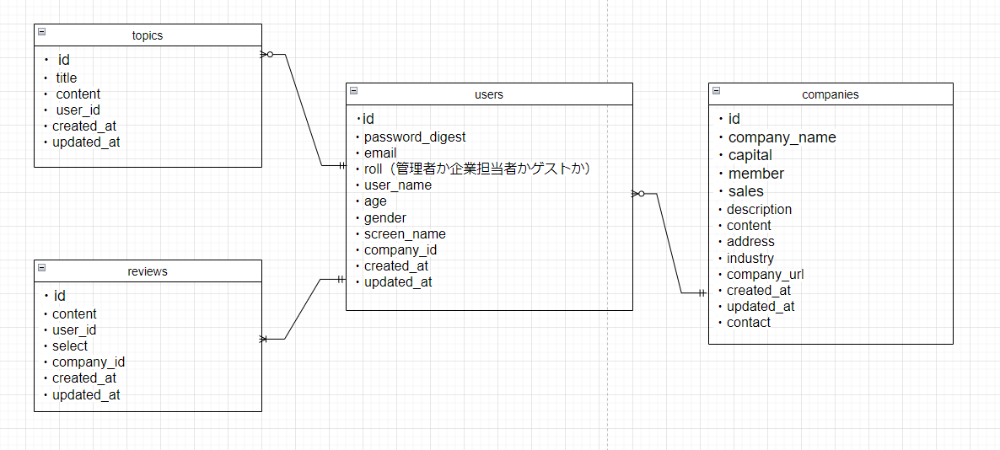

# Daisy App

## Rubyのバージョン
- ruby 3.3.0
- rails 6.1.7.7

## アプリケーションの実行手順（クローンから起動までの手順）

```sh
git clone gitのURL記入
cd Daisy_app
bundle install
yarn install
rails db:create
rails db:migrate
rails s
```

## カタログ設計、テーブル定義書
[カタログ設計、テーブル定義書](https://docs.google.com/spreadsheets/d/1Q1DK67h7Qj0sOoewr6covppNNWUm8ZxPmYHqRLLBI7A/edit?gid=0#gid=0)

## ワイヤーフレーム（画面遷移図）
[ワイヤーフレーム](https://www.figma.com/design/R4U9J2Q7leGJqyQG1LldKL/Daisy%E3%83%AF%E3%82%A4%E3%83%A4%E3%83%BC%E3%83%95%E3%83%AC%E3%83%BC%E3%83%A0?t=yPcQ32mLpcxhIfef-0)

## 画面遷移図
